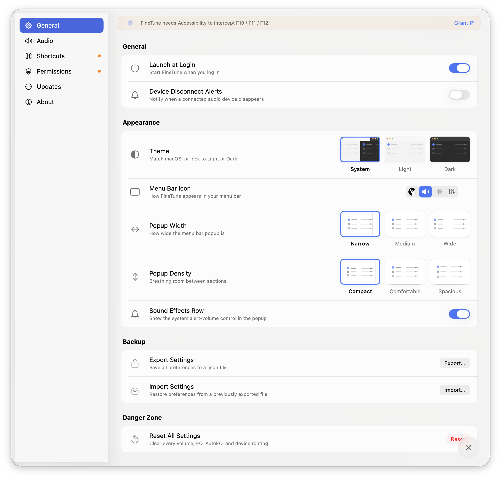
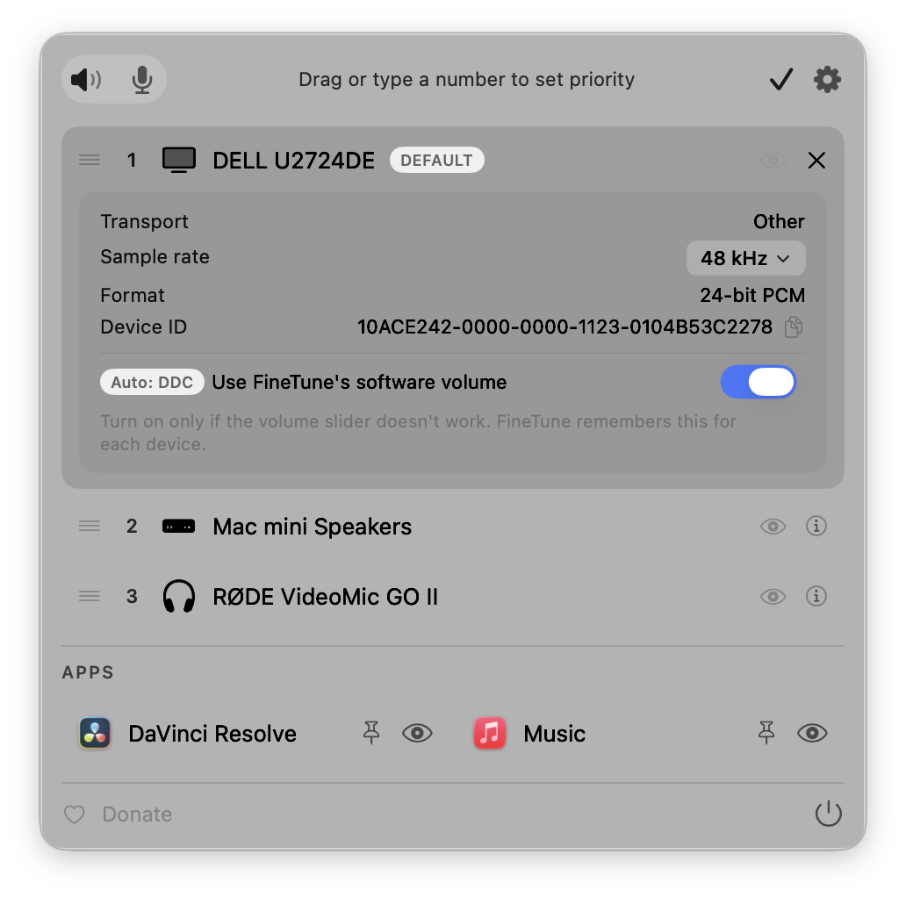
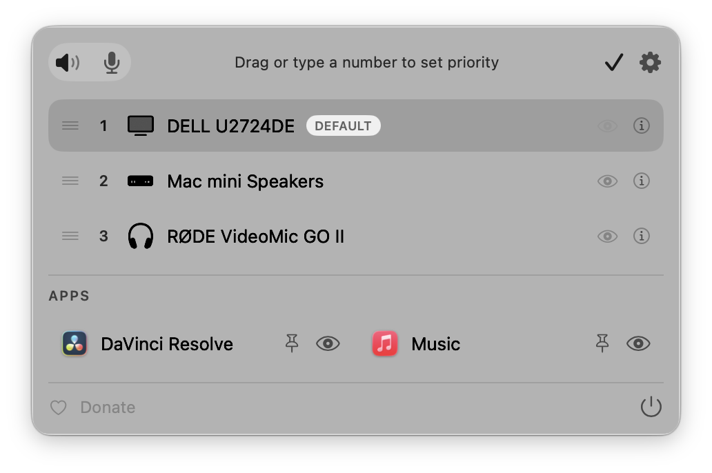
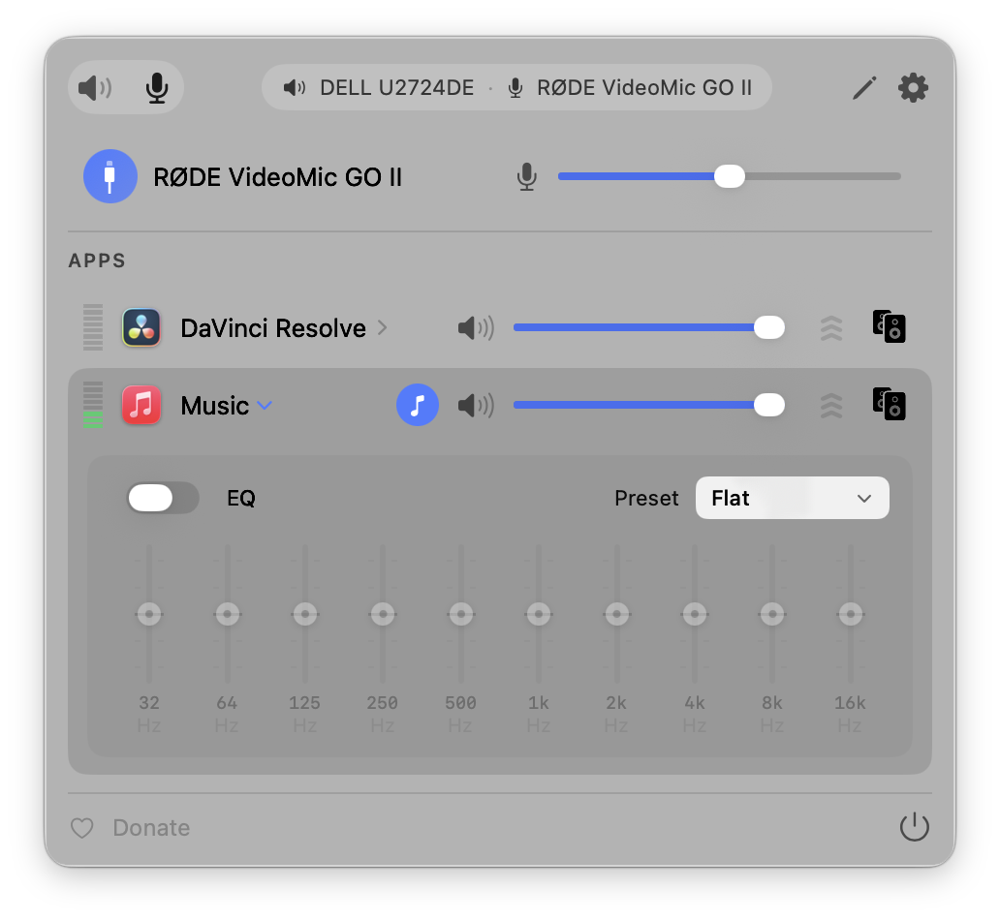

<h3>FineTune</h3>

Control the volume of every app independently, boost quiet ones up to 4×, route audio to different speakers, and shape your sound with EQ and headphone correction. Lives in your menu bar. Free and open-source.

> 🔧 **Customized fork of [FineTune by Ronit Singh](https://github.com/ronitsingh10/FineTune)** (GPL-3.0), with extra features and fixes — see [What's new in this version](#-whats-new-in-this-version).

<a href="https://github.com/gudelgado1/FineTune-LiquidGlass-Version/releases/latest"></a>

<br clear="all"/>

<p align="center">
  <a href="https://github.com/gudelgado1/FineTune-LiquidGlass-Version/releases/latest"></a>
  <a href="LICENSE"></a>
  <a href="https://www.apple.com/macos/"></a>
</p>

<p align="center">
  <strong>English</strong> · <a href="README.pt-BR.md">Português (Brasil)</a>
</p>

<table>
  <tr>
    <td align="center" width="50%">
      <br>
      <sub><b>Per-app volume, boost &amp; multi-device routing</b></sub>
    </td>
    <td align="center" width="50%">
      <br>
      <sub><b>10-band EQ + AutoEQ headphone correction</b></sub>
    </td>
  </tr>
  <tr>
    <td align="center">
      <br>
      <sub><b>Settings</b></sub>
    </td>
    <td align="center">
      <br>
      <sub><b>Device inspector (sample rate, transport, software volume)</b></sub>
    </td>
  </tr>
  <tr>
    <td align="center">
      <br>
      <sub><b>Edit mode — device priority &amp; hiding</b></sub>
    </td>
    <td align="center">
      <br>
      <sub><b>Input devices</b></sub>
    </td>
  </tr>
</table>

## ✨ What's new in this version

On top of upstream FineTune, this fork adds:

- **Media transport keys (F7 / F8 / F9)** — beyond the F10–F12 volume keys, FineTune intercepts Play/Pause, Next, and Previous and routes them to a **default media app you choose** in the Apps tab. It's a system-wide override (no key recording required) — handy when several apps could respond to the keys.
- **Permissions tab** — a dedicated Settings section that shows the live status of every macOS permission FineTune needs and requests them all on first launch.
- **System Sound Effects row** — adjust the macOS alert/UI sound level right from the menu-bar popup (its visibility is toggleable under the popup options).
- **Separate popup Width and Density** — size the popup (Narrow / Medium / Wide) independently from its row density (Compact / Comfortable / Spacious), and show/hide the Sound Effects row.
- **Double-click an EQ band to reset it** to 0 dB.
- **HDMI / DDC volume re-syncs after sleep** — monitors controlled over DDC/CI re-probe on wake, so device volume keeps matching the app volume.
- **Theme-aware Liquid Glass HUD** — the on-screen volume HUD renders correctly in Light mode and no longer shows a stray shadow box; clean on every backdrop.
- **Fix: no volume jump when resuming an idle app** — a paused app keeps its audio tap "warm," so resuming playback no longer briefly spikes the level.
- **Lower minimum: macOS 14.2+** — Liquid Glass visuals light up on macOS 26 (Tahoe) and fall back to standard materials on 14/15.

## Install

> This fork is **ad-hoc signed**. On first launch, right-click the app → **Open** (or System Settings → Privacy & Security → **Open Anyway**).

**Build from source** (recommended)

```bash
git clone https://github.com/gudelgado1/FineTune-LiquidGlass-Version.git
cd FineTune-LiquidGlass-Version
open FineTune.xcodeproj   # Xcode 16 — build & run the "FineTune" scheme
```

**Manual** — download the latest build from [Releases](https://github.com/gudelgado1/FineTune-LiquidGlass-Version/releases/latest), move it to `/Applications`, and open it.

## Quick Start

1. Launch FineTune from your Applications folder.
2. Grant **System Audio Recording** when prompted (and **Accessibility** if you want media-key control). The **Permissions** tab in Settings shows the status of each and can request them all at once.
3. Click the FineTune icon in your menu bar. Apps playing audio appear automatically.

That's it. Adjust sliders, route audio, and explore EQ from the menu bar.

> **Tip:** Want FineTune to auto-switch to a specific device when you connect it? Open edit mode (pencil icon) and drag it above the built-in speakers. This is a one-time setup — your preferred order is saved permanently.

## Features

### 🎚 Volume Control
- **Per-app volume** — Individual sliders and mute for each application
- **Per-app volume boost** — 2× / 3× / 4× gain presets
- **Pinned apps** — Keep apps visible in the menu bar even when they're not playing, so you can configure volume, EQ, and routing in advance
- **Ignore apps** — Completely disengage FineTune from specific apps. Tears down the audio tap so the app returns to normal macOS audio
- **Scroll-wheel volume** — Hover any slider in the popup, the HUD, or the EQ panel and scroll to adjust

### ⌨️ Keyboard
- **Media transport keys (F7 / F8 / F9)** — Optional system-wide override for **Play/Pause**, **Next**, and **Previous**, routed to a default media app you pick in the Apps tab
- **Global volume hotkeys** — Bind your own keys to **App Volume Up**, **App Volume Down**, and **App Mute** from Settings → Shortcuts. The "app" is whichever is currently making sound, so volume-down while a YouTube tab plays behind a foreground Terminal turns down YouTube, not the terminal. If nothing is audible, the hotkey falls through to the frontmost app
- **Toggle the popup from anywhere** — Bind a hotkey to **Toggle FineTune Popup**; it opens or closes on demand, including from full-screen apps
- **Configurable step size** — Pick **Coarse / Normal / Fine / Extra-Fine** under Settings → Shortcuts → Volume Step. The same setting governs the F10–F12 media keys, the global hotkeys, and the popup's arrow-key navigation
- **Hold to ramp, auto-unmute on volume-up** — Holding App Volume Up or Down emits repeats the way macOS does for arrow keys. Volume-up while muted unmutes and sets the new level in one keystroke
- **Drive the popup with the keyboard** — **↑ / ↓** move between rows, **← / →** adjust the focused row (Shift = 2× step), **M** toggles mute, **Return / Space** activates, **Tab** switches Output/Input tabs, **Esc** closes

### 🔀 Audio Routing
- **Multi-device output** — Route audio to multiple devices simultaneously
- **Audio routing** — Send apps to different outputs or follow system default
- **Device priority** — Choose which device FineTune switches to when a new device connects; auto-fallback on disconnect
- **Auto-restore** — When a device reconnects, apps automatically return to it with their volume, routing, and EQ intact

### 🎛 EQ & Correction
- **10-band EQ** — 20 presets across 5 categories; **double-click a band to reset it to 0 dB**
- **User EQ presets** — Save, rename, and manage custom EQ configurations per app
- **AutoEQ headphone correction** — Search thousands of headphone profiles or import your own ParametricEQ.txt files for per-device frequency response correction
- **Loudness compensation** — Automatic bass and treble correction at low volumes using ISO 226:2023 equal-loudness contours, with real-time level management to keep perceived loudness consistent

### 🖥 Devices & System
- **Input device control** — Monitor and adjust microphone levels
- **System Sound Effects** — Control the macOS alert/UI sound level from the popup or settings
- **Smart volume backend** — FineTune auto-picks hardware, DDC, or software volume per device. If a USB DAC or HDMI output's hardware slider doesn't actually control level, force software volume from the device inspector and FineTune remembers the choice
- **Monitor speaker control over DDC** — Adjust volume on external displays via DDC/CI, and it **re-syncs automatically after the Mac wakes from sleep**
- **Device inspector** — Sample rate (with picker), transport, UID copy, hog-mode banner, and the software-volume override
- **Hide devices** — Eye toggle in edit mode hides output/input devices you don't want listed
- **Bluetooth device management** — Connect paired devices directly from the menu bar
- **Media keys & Volume HUD** — Opt-in F10–F12 control for the default output device, with a Tahoe-style or Classic-style on-screen HUD that follows your theme. The write goes through FineTune's volume pipeline, so keys keep working on USB interfaces and HDMI outputs where macOS's own keys are greyed out
- **Dynamic menu bar icon** — Four styles (Default, Speaker, Waveform, Equalizer). **Speaker** tracks volume live and shows a slashed speaker when muted; all styles flash the new output's SF Symbol on device switch. Applies instantly, no relaunch
- **URL schemes** — Automate volume, mute, device routing, and more from scripts

### 🎨 Appearance
- **Light or Dark theme** — Settings → General → Theme matches macOS or locks FineTune to Light or Dark. The popup, every popover, and the volume HUD switch immediately
- **Popup Width & Density** — Size the popup (**Narrow / Medium / Wide**) independently from its row density (**Compact / Comfortable / Spacious**), with a live preview, and show/hide the Sound Effects row
- **Liquid Glass** — Native Liquid Glass on macOS 26 (Tahoe), with graceful fallback to standard materials on macOS 14/15

## Documentation

- **[AutoEQ & Headphone Correction](guide/autoeq.md)** — Apply frequency correction from the [AutoEQ](https://github.com/jaakkopasanen/AutoEq) project, import [EqualizerAPO](https://sourceforge.net/projects/equalizerapo/) profiles, or browse [autoeq.app](https://www.autoeq.app/)
- **[URL Schemes](guide/url-schemes.md)** — Automate FineTune from Terminal, Shortcuts, Raycast, or scripts
- **[Troubleshooting](guide/troubleshooting.md)** — Permission issues, missing apps, audio problems

## Requirements

- macOS **14.2** (Sonoma) or later — Liquid Glass visuals require macOS 26 (Tahoe)
- **System Audio Recording** permission (Core Audio process taps; prompted on first launch)
- **Accessibility** permission for media-key interception (F7–F12)

## Architecture (for contributors)

- `AudioEngine` (stored state) + `AudioEngine+*.swift` extensions (behavior)
- `ProcessTapController` — RT-safe audio callbacks (no allocation/locks/ObjC in the audio path); **no driver or kernel extension**
- Monitors: `AudioProcessMonitor`, `DeviceVolumeMonitor`, `AudioDeviceMonitor`; `DDCController` for HDMI/DDC
- `HUDWindowController` + the Liquid Glass design system in `Views/DesignSystem`
- `FluidMenuBarExtra` (MIT) is vendored under `FineTune/ThirdParty/`

## Credits

FineTune was created by **[Ronit Singh](https://github.com/ronitsingh10)**. This project is a fork that builds on his work; the original design and the bulk of the codebase are his. If the app made your day easier, consider supporting the original author:

[](https://ko-fi.com/ronitsingh10)

## License

[GPL v3](LICENSE) — same as upstream. Per GPL-3.0, this fork preserves the original copyright and license notices.
