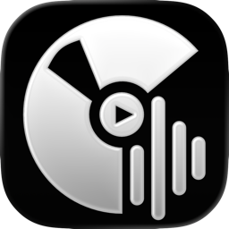
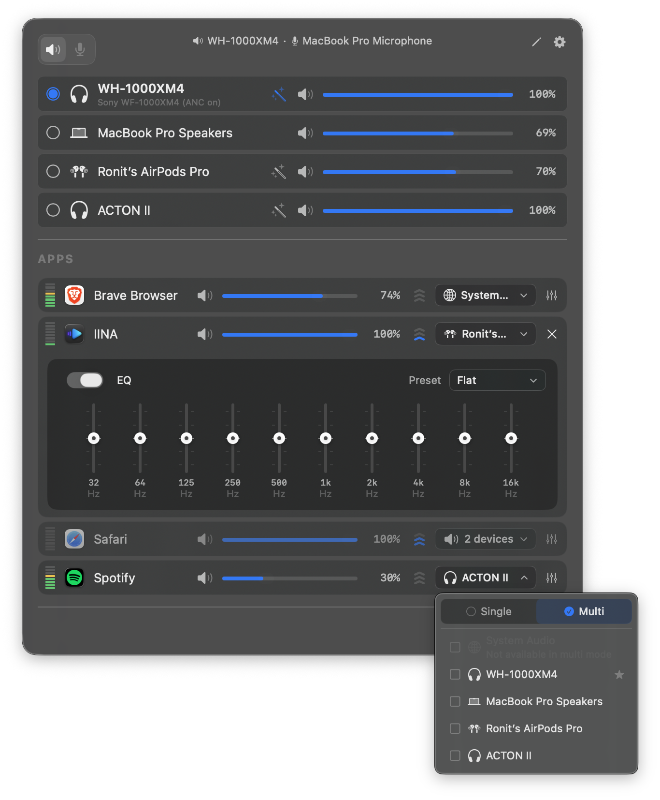
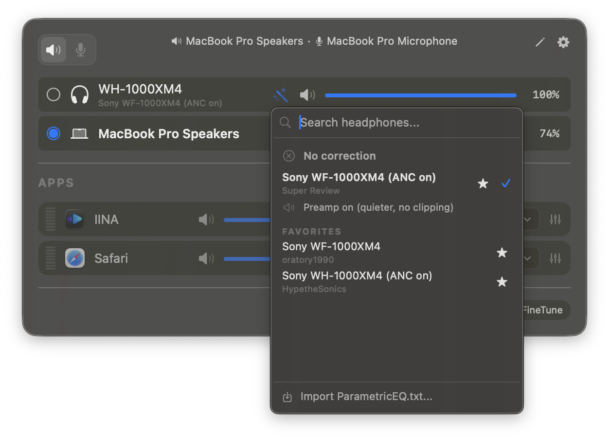

<h3>FineTune</h3>

Controle o volume de cada aplicativo de forma independente, reforce os mais baixos em até 4×, direcione o áudio para diferentes saídas e molde o som com EQ e correção de fones. Fica na barra de menus. Gratuito e de código aberto.

> 🔧 **Fork personalizado do [FineTune de Ronit Singh](https://github.com/ronitsingh10/FineTune)** (GPL-3.0), com recursos e correções extras — veja [Novidades desta versão](#-novidades-desta-versão).

<a href="https://github.com/gudelgado1/FineTune-LiquidGlass-Version/releases/latest"></a>

<br clear="all"/>

<p align="center">
  <a href="https://github.com/gudelgado1/FineTune-LiquidGlass-Version/releases/latest"></a>
  <a href="LICENSE"></a>
  <a href="https://www.apple.com/macos/"></a>
</p>

<p align="center">
  <a href="README.md">English</a> · <strong>Português (Brasil)</strong>
</p>

<p align="center">
  
</p>
<p align="center">
  
</p>

## ✨ Novidades desta versão

Além do FineTune original, este fork adiciona:

- **Teclas de transporte de mídia (F7 / F8 / F9)** — além das teclas de volume F10–F12, o FineTune intercepta Play/Pause, Avançar e Retroceder e as direciona para um **app de mídia padrão que você escolhe** na aba Apps. É uma sobreposição de sistema (sem precisar gravar tecla) — útil quando vários apps poderiam responder às teclas.
- **Aba de Permissões** — uma seção dedicada em Configurações que mostra o status ao vivo de cada permissão do macOS que o FineTune precisa e pede todas no primeiro launch.
- **Linha de Efeitos de Som do sistema** — ajuste o nível dos sons de alerta/UI do macOS direto pelo popup da barra de menus (a visibilidade dela é configurável nas opções do popup).
- **Largura e Densidade do popup separadas** — defina o tamanho do popup (Estreito / Médio / Largo) de forma independente da densidade das linhas (Compacto / Confortável / Espaçoso), e mostre/oculte a linha de Efeitos de Som.
- **Duplo-clique numa banda do EQ para zerá-la** (0 dB).
- **Volume HDMI / DDC re-sincroniza após o Sleep** — monitores controlados via DDC/CI fazem re-probe ao acordar, então o volume do dispositivo continua correspondendo ao volume do app.
- **HUD em Liquid Glass adaptado ao tema** — o HUD de volume na tela renderiza correto no modo Light e não mostra mais o retângulo de sombra; limpo em qualquer fundo.
- **Correção: sem salto de volume ao retomar um app ocioso** — um app pausado mantém seu tap de áudio "quente", então retomar a reprodução não dispara mais um pico de volume.
- **Mínimo reduzido: macOS 14.2+** — os visuais Liquid Glass acendem no macOS 26 (Tahoe) e usam materiais padrão no 14/15.

## Instalação

> Este fork é assinado **ad-hoc**. No primeiro launch, clique com o botão direito no app → **Abrir** (ou Ajustes do Sistema → Privacidade e Segurança → **Abrir Mesmo Assim**).

**Compilar do código-fonte** (recomendado)

```bash
git clone https://github.com/gudelgado1/FineTune-LiquidGlass-Version.git
cd FineTune-LiquidGlass-Version
open FineTune.xcodeproj   # Xcode 16 — compile e rode o esquema "FineTune"
```

**Manual** — baixe a build mais recente em [Releases](https://github.com/gudelgado1/FineTune-LiquidGlass-Version/releases/latest), mova para `/Applications` e abra.

## Início rápido

1. Abra o FineTune pela pasta Aplicativos.
2. Conceda **Gravação de Áudio do Sistema** quando solicitado (e **Acessibilidade** se quiser o controle por teclas de mídia). A aba **Permissões** em Configurações mostra o status de cada uma e pode pedir todas de uma vez.
3. Clique no ícone do FineTune na barra de menus. Apps tocando áudio aparecem automaticamente.

Pronto. Ajuste os sliders, direcione o áudio e explore o EQ pela barra de menus.

> **Dica:** Quer que o FineTune troque automaticamente para um dispositivo quando você o conecta? Entre no modo de edição (ícone de lápis) e arraste-o acima das caixas internas. É uma configuração única — sua ordem preferida fica salva permanentemente.

## Recursos

### 🎚 Controle de volume
- **Volume por app** — Sliders individuais e mute para cada aplicativo
- **Boost de volume por app** — Presets de ganho 2× / 3× / 4×
- **Apps fixados** — Mantenha apps visíveis na barra de menus mesmo quando não estão tocando, para configurar volume, EQ e roteamento antecipadamente
- **Ignorar apps** — Desacople totalmente o FineTune de apps específicos. Desfaz o tap de áudio para o app voltar ao áudio normal do macOS
- **Volume pela roda do mouse** — Passe o cursor sobre qualquer slider (popup, HUD ou painel de EQ) e role para ajustar

### ⌨️ Teclado
- **Teclas de transporte de mídia (F7 / F8 / F9)** — Sobreposição opcional de sistema para **Play/Pause**, **Avançar** e **Retroceder**, direcionadas a um app de mídia padrão que você escolhe na aba Apps
- **Atalhos globais de volume** — Vincule suas próprias teclas a **Aumentar Volume do App**, **Diminuir Volume do App** e **Mutar App** em Configurações → Atalhos. O "app" é aquele que está tocando som no momento, então diminuir o volume enquanto uma aba do YouTube toca atrás de um Terminal em primeiro plano abaixa o YouTube, não o terminal. Se nada estiver audível, o atalho recai sobre o app em foco
- **Abrir/fechar o popup de qualquer lugar** — Vincule um atalho a **Alternar Popup do FineTune**; abre ou fecha sob demanda, inclusive de apps em tela cheia
- **Tamanho do passo configurável** — Escolha **Grosso / Normal / Fino / Extra-Fino** em Configurações → Atalhos → Passo de Volume. O mesmo ajuste vale para as teclas F10–F12, os atalhos globais e a navegação por setas no popup
- **Segurar para variar, auto-desmutar ao aumentar** — Segurar Aumentar/Diminuir Volume repete como o macOS faz com as setas. Aumentar o volume com o app mutado desmuta e define o novo nível num só toque
- **Controlar o popup pelo teclado** — **↑ / ↓** movem entre linhas, **← / →** ajustam a linha em foco (Shift = passo 2×), **M** alterna mute, **Return / Espaço** ativa, **Tab** alterna abas de Saída/Entrada, **Esc** fecha

### 🔀 Roteamento de áudio
- **Saída multi-dispositivo** — Direcione o áudio para vários dispositivos ao mesmo tempo
- **Roteamento de áudio** — Envie apps para saídas diferentes ou siga o padrão do sistema
- **Prioridade de dispositivos** — Escolha para qual dispositivo o FineTune troca quando um novo é conectado; fallback automático na desconexão
- **Restauração automática** — Quando um dispositivo reconecta, os apps voltam a ele com volume, roteamento e EQ intactos

### 🎛 EQ e correção
- **EQ de 10 bandas** — 20 presets em 5 categorias; **duplo-clique numa banda para zerar em 0 dB**
- **Presets de EQ do usuário** — Salve, renomeie e gerencie configurações de EQ personalizadas por app
- **Correção de fones AutoEQ** — Busque milhares de perfis de fones ou importe seus próprios arquivos ParametricEQ.txt para correção de resposta de frequência por dispositivo
- **Compensação de loudness** — Correção automática de graves e agudos em volumes baixos usando as curvas de igual intensidade ISO 226:2023, com gestão de nível em tempo real para manter a sonoridade percebida consistente

### 🖥 Dispositivos e sistema
- **Controle de dispositivo de entrada** — Monitore e ajuste níveis de microfone
- **Efeitos de Som do sistema** — Controle o nível dos sons de alerta/UI do macOS pelo popup ou pelas configurações
- **Backend de volume inteligente** — O FineTune escolhe automaticamente volume por hardware, DDC ou software para cada dispositivo. Se o slider de hardware de um DAC USB ou saída HDMI não controla o nível de fato, force o volume por software no inspetor de dispositivo e o FineTune lembra a escolha
- **Controle de monitor via DDC** — Ajuste o volume em telas externas via DDC/CI, e ele **re-sincroniza automaticamente quando o Mac acorda do Sleep**
- **Inspetor de dispositivo** — Taxa de amostragem (com seletor), transporte, cópia de UID, aviso de hog-mode e a sobreposição de volume por software
- **Ocultar dispositivos** — Botão de olho no modo de edição oculta dispositivos de saída/entrada que você não quer na lista
- **Gerenciamento de Bluetooth** — Conecte dispositivos pareados direto pela barra de menus
- **Teclas de mídia e HUD de volume** — Controle opt-in F10–F12 para o dispositivo de saída padrão, com um HUD na tela estilo Tahoe ou Clássico que segue o seu tema. A escrita passa pelo pipeline de volume do FineTune, então as teclas continuam funcionando em interfaces USB e saídas HDMI onde as próprias teclas do macOS ficam acinzentadas
- **Ícone dinâmico na barra de menus** — Quatro estilos (Padrão, Alto-falante, Forma de onda, Equalizador). O **Alto-falante** acompanha o volume ao vivo e mostra um alto-falante cortado quando mutado; todos os estilos piscam o SF Symbol da nova saída ao trocar de dispositivo. Aplica na hora, sem reabrir
- **URL schemes** — Automatize volume, mute, roteamento de dispositivo e mais a partir de scripts

### 🎨 Aparência
- **Tema Claro ou Escuro** — Configurações → Geral → Tema acompanha o macOS ou trava o FineTune em Claro ou Escuro. O popup, todos os popovers e o HUD de volume mudam imediatamente
- **Largura e Densidade do popup** — Defina o tamanho do popup (**Estreito / Médio / Largo**) de forma independente da densidade das linhas (**Compacto / Confortável / Espaçoso**), com pré-visualização ao vivo, e mostre/oculte a linha de Efeitos de Som
- **Liquid Glass** — Liquid Glass nativo no macOS 26 (Tahoe), com fallback elegante para materiais padrão no macOS 14/15

## Documentação

- **[AutoEQ e Correção de Fones](guide/autoeq.md)** — Aplique correção de frequência do projeto [AutoEQ](https://github.com/jaakkopasanen/AutoEq), importe perfis do [EqualizerAPO](https://sourceforge.net/projects/equalizerapo/) ou navegue em [autoeq.app](https://www.autoeq.app/)
- **[URL Schemes](guide/url-schemes.md)** — Automatize o FineTune pelo Terminal, Atalhos, Raycast ou scripts
- **[Solução de problemas](guide/troubleshooting.md)** — Problemas de permissão, apps faltando, problemas de áudio

## Requisitos

- macOS **14.2** (Sonoma) ou superior — os visuais Liquid Glass exigem macOS 26 (Tahoe)
- Permissão de **Gravação de Áudio do Sistema** (process taps do Core Audio; solicitada no primeiro launch)
- Permissão de **Acessibilidade** para interceptar as teclas de mídia (F7–F12)

## Arquitetura (para contribuidores)

- `AudioEngine` (estado armazenado) + extensões `AudioEngine+*.swift` (comportamento)
- `ProcessTapController` — callbacks de áudio RT-safe (sem alocação/locks/ObjC no caminho de áudio); **sem driver nem kernel extension**
- Monitores: `AudioProcessMonitor`, `DeviceVolumeMonitor`, `AudioDeviceMonitor`; `DDCController` para HDMI/DDC
- `HUDWindowController` + o design system Liquid Glass em `Views/DesignSystem`
- `FluidMenuBarExtra` (MIT) é vendored em `FineTune/ThirdParty/`

## Créditos

O FineTune foi criado por **[Ronit Singh](https://github.com/ronitsingh10)**. Este projeto é um fork que parte do trabalho dele; o design original e a maior parte do código são dele. Se o app facilitou o seu dia, considere apoiar o autor original:

[](https://ko-fi.com/ronitsingh10)

## Licença

[GPL v3](LICENSE) — igual ao upstream. Conforme a GPL-3.0, este fork preserva os avisos de copyright e licença originais.
